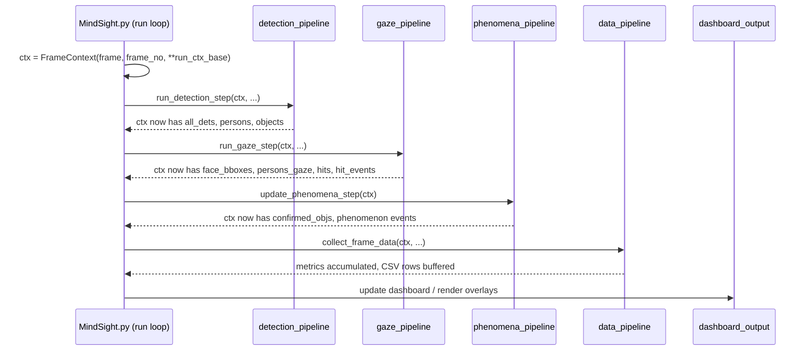

# Architecture Deep Dive

## Overview

MindSight is a thin orchestrator (`MindSight.py`, ~718 lines) that wires together four pipeline stage modules. All stages communicate through a shared `FrameContext` object created once per frame. The orchestrator itself contains no domain logic -- it simply sequences the stages, manages the video capture loop, and holds run-level state such as smoothers, trackers, and output paths.

The four stages are:

1. **Object Detection** -- detect people and objects in the frame.
2. **Gaze Tracking** -- estimate gaze rays for each detected face.
3. **Phenomena Analysis** -- derive higher-level social gaze phenomena.
4. **Data Collection** -- accumulate metrics and write outputs.

## Module Dependency Graph

```mermaid
graph TD
    MS[MindSight.py] --> DP[ms/ObjectDetection/detection_pipeline]
    MS --> GP[ms/GazeTracking/gaze_pipeline]
    MS --> PP[ms/Phenomena/phenomena_pipeline]
    MS --> DC[ms/DataCollection/data_pipeline]

    DP --> OD[ms/ObjectDetection/object_detection]
    DP --> MF[ms/ObjectDetection/model_factory]

    GP --> GPR[ms/GazeTracking/gaze_processing]
    GP --> GI[ms/GazeTracking/__init__]
    GP --> GBE[ms/GazeTracking/Backends/*]

    PP --> PT[ms/Phenomena/phenomena_tracking]
    PP --> PC[ms/Phenomena/phenomena_config]
    PP --> PH[ms/Phenomena/helpers]
    PP --> PD[ms/Phenomena/Default/*]

    DC --> CSV[ms/DataCollection/csv_output]
    DC --> HM[ms/DataCollection/heatmap_output]
    DC --> DB[ms/DataCollection/dashboard_output]

    MS --> CFG[ms/pipeline_config.py]
    MS --> PLG[Plugins/__init__.py]

    PLG --> GREG[gaze_registry]
    PLG --> OREG[object_detection_registry]
    PLG --> PREG[phenomena_registry]
```



`Plugins/__init__.py` provides base classes and registries that each plugin subdirectory hooks into. `ms/pipeline_config.py` defines `FrameContext` and the configuration dataclasses consumed by every stage.

## The Orchestrator: MindSight.py

### `main()`

Entry point. Parses CLI arguments (each module registers its own flags), loads an optional pipeline YAML file, and dispatches into either single-video mode or project mode (batch processing a directory of videos).

### `run(video_path, args, ...)`

Opens the video capture and creates the per-run tracker objects that persist across frames:

- `GazeSmootherReID` -- temporal smoothing of gaze rays with re-identification.
- `GazeLockTracker` -- fixation lock-on / dwell detection.
- `SnapHysteresisTracker` -- hysteresis-based snap-to-object logic.
- `ObjectPersistenceCache` -- short-term memory for disappeared objects.

These are bundled into `run_ctx_base` and seeded into every `FrameContext`. The function then iterates frames, calling `process_frame()` for each one.

### `process_frame(ctx, ...)`

Calls the four pipeline stages in order:

1. `run_detection_step(ctx, ...)`
2. `run_gaze_step(ctx, ...)`
3. `update_phenomena_step(ctx)`
4. `collect_frame_data(ctx, ...)`

After the stages complete, it handles display rendering and dashboard updates.

### `_build_from_args(args)`

Factory function that reads the argparse namespace and instantiates the correct model backends (e.g., YOLO variant, Gazelle variant) via the model factory and plugin registries.

## Pipeline Stages

| Stage | Entry Point | Module |
|-------|-------------|--------|
| Detection | `run_detection_step(ctx, ...)` | `ms/ObjectDetection/detection_pipeline.py` |
| Gaze | `run_gaze_step(ctx, ...)` | `ms/GazeTracking/gaze_pipeline.py` |
| Phenomena | `update_phenomena_step(ctx)` | `ms/Phenomena/phenomena_pipeline.py` |
| Data Collection | `collect_frame_data(ctx, ...)` | `ms/DataCollection/data_pipeline.py` |

Each stage reads from and writes to the `FrameContext`. See [FrameContext Reference](frame-context.md) for the full key registry.

## Configuration Hierarchy

All configuration dataclasses follow the same pattern: they are constructed via a `from_namespace(args)` class method that pulls values from the argparse namespace.

- **GazeConfig** -- ray parameters, snap distance, cone angle, smoothing window, gaze lock thresholds.
- **DetectionConfig** -- confidence threshold, COCO class IDs, blacklist labels, detection scale factor.
- **TrackerConfig** -- gaze lock frames, dwell frame count, skip frames, re-ID parameters (IoU, feature distance).
- **OutputConfig** -- save directory paths, PID map file, anonymization mode, video writer settings.
- **PhenomenaConfig** -- per-phenomenon enable/disable toggles and their individual thresholds (e.g., mutual gaze angle, joint attention confirmation frames).

All of these are defined in `ms/pipeline_config.py` or in their respective module configs (e.g., `ms/Phenomena/phenomena_config.py`).

## CLI Argument Registration

Each module owns its CLI flags through an `add_arguments(parser)` function. During startup, `MindSight.py` calls each module's registration function in turn:

```
ObjectDetection  → add_arguments(parser)
GazeTracking     → add_arguments(parser)
Phenomena        → add_arguments(parser)
DataCollection   → add_arguments(parser)
Plugins (each)   → add_arguments(parser)
```

This keeps flag definitions co-located with the code that consumes them. Plugins also participate: each discovered plugin can register its own flags, which appear alongside the built-in ones.

## Per-Frame Sequence



## GUI Architecture

The GUI is built with PyQt and lives in the `ms/GUI/` directory.

- **`main_window.py`** creates the application window with three tabs:
  - **`GazeTab`** (`gaze_tab.py`) -- live video view with gaze overlay, controls for starting/stopping tracking.
  - **`VPBuilderTab`** (`vp_builder_tab.py`) -- visual pipeline builder for constructing and editing pipeline YAML configurations.
  - **`ProjectTab`** (`project_tab.py`) -- project configuration and batch processing. Two-panel layout with a configuration panel (pipeline, participants, conditions, output settings) and a monitoring panel (sources, preview, progress, log). Supports importing pipeline settings from the Gaze Tab, visual editing of participant labels and condition tags, and custom output directories.

- **`workers.py`** contains `threading.Thread`-based workers that run the tracking pipeline in the background so the UI remains responsive. `ProjectWorker` accepts a `ProjectConfig` and uses it for per-video metadata (condition tags, participant labels) and post-processing (global and per-condition CSV generation).
- **`pipeline_dialog.py`** provides import/export for pipeline YAML files. `_namespace_to_yaml_dict()` converts a namespace to a structured YAML dict.
- **`widgets.py`** and **`phenomena_panel.py`** supply reusable UI components.
- **`plugin_panel.py`** renders plugin configuration controls dynamically from registered plugins.

## Plugin Integration Points

Plugins hook into three registries defined in `Plugins/__init__.py`:

| Registry | Purpose | Example |
|----------|---------|---------|
| `gaze_registry` | Alternative gaze estimation backends | Gazelle |
| `object_detection_registry` | Alternative detection backends | Custom YOLO variants |
| `phenomena_registry` | New social gaze phenomena | Custom attention metrics |

Auto-discovery scans `Plugins/` subdirectories at startup. The gaze registry also scans `ms/GazeTracking/Backends/` for built-in gaze backends (MGaze, L2CS, UniGaze). Each plugin package exposes a registration function that inserts itself into the appropriate registry. Plugins can also provide `add_arguments(parser)` to register their own CLI flags.

## Auxiliary Video Streams

MindSight supports optional per-participant auxiliary video feeds (e.g., eye cameras, first-person views) that are frame-synchronised with the main source. Auxiliary streams are configured via `--aux-stream` CLI flags or the `aux_streams` YAML section and are parsed into `AuxStreamConfig` instances. Each frame, the run loop reads one frame from every auxiliary capture and stores them in `FrameContext['aux_frames']` keyed by `"PID:TYPE"`. Auxiliary frames are not processed by any built-in pipeline stage but are passed to plugins (gaze backends, phenomena trackers) for consumption.

## Related Documentation

- [FrameContext Reference](frame-context.md)
- [Object Detection Module](object-detection-module.md)
- [Gaze Processing Module](gaze-processing-module.md)
- [Plugin System](plugin-system.md)
