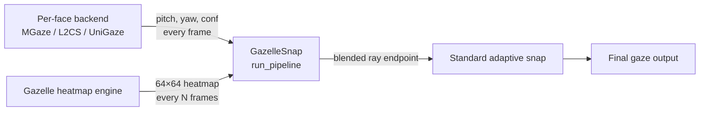

# Gaze Plugin Tutorial

> **See also:** [Phenomena Plugin Tutorial](phenomena-plugin-tutorial.md) | [Object Detection Plugin Tutorial](object-detection-plugin-tutorial.md) | [Data Collection Plugin Tutorial](data-collection-plugin-tutorial.md)

This tutorial covers all three gaze plugin patterns by walking through real backends that ship with MindSight:

- **[Part A — Per-face mode:](#part-a-per-face-backend-mgaze)** The MGaze backend (`GazeTracking/Backends/MGaze/MGaze_Tracking.py`), which crops each face and estimates pitch/yaw angles independently.
- **[Part B — Scene-level mode:](#part-b-scene-level-backend-gazelle)** The Gazelle backend (`Plugins/GazeTracking/Gazelle/gazelle_backend.py`), which processes the full frame and all faces in a single DINOv2 forward pass.
- **[Part C — Composite / processing augmentation:](#part-c-composite-backend-adding-gaze-processing-features-gazellesnap)** The GazelleSnap backend (`Plugins/GazeTracking/GazelleSnap/gazelle_snap_backend.py`), which wraps an existing per-face backend and augments it with periodic Gazelle heatmap-based ray blending.

---

## Per-Face vs Scene-Level: When to Use Which

| Aspect | Per-face (`mode="per_face"`) | Scene-level (`mode="scene"`) |
|--------|-----|------|
| Core method | `estimate(face_bgr)` → `(pitch, yaw, conf)` | `estimate_frame(frame, bboxes)` → `[(xy, conf)]` |
| Input | Single cropped face image | Full frame + all face bounding boxes |
| Gaze format | Pitch/yaw angles (radians) | Pixel coordinates in the original frame |
| GPU passes | One per face | One for all faces |
| Ray construction | Handled by `run_pitchyaw_pipeline` | Handled by the gaze coordinator's default scene handler |
| Best for | Lightweight models, CPU, ONNX inference | Heavy models, GPU batch processing, heatmap outputs |

Choose your mode based on what your model produces. If it outputs pitch/yaw angles from a face crop, use per-face. If it takes the full scene and outputs gaze target coordinates, use scene-level.

---

# Part A: Per-Face Backend (MGaze)

The MGaze plugin is MindSight's default gaze backend. It supports both ONNX and PyTorch inference, wrapping the vendored `gaze-estimation` library. It demonstrates the per-face pattern where `estimate()` receives a single cropped face and returns pitch/yaw angles.

**Source:** `GazeTracking/Backends/MGaze/MGaze_Tracking.py`

---

## A1. File Structure

```
GazeTracking/Backends/MGaze/
├── __init__.py
├── MGaze_Tracking.py       # PLUGIN_CLASS = MGazePlugin
├── MGaze_Config.py         # DEFAULT_ONNX_MODEL, ARCH_CHOICES, DATA_CONFIG
└── gaze-estimation/        # Vendored gaze-estimation library
    ├── weights/
    │   └── mobileone_s0_gaze.onnx  # Default shipped model
    ├── models/
    │   ├── resnet.py
    │   ├── mobilenet.py
    │   └── mobileone.py
    ├── onnx_inference.py    # GazeEstimationONNX base class
    └── config.py
```

!!! note
    MGaze lives under `GazeTracking/Backends/` (not `Plugins/GazeTracking/`). The gaze registry discovers both locations — built-in backends from `GazeTracking/Backends/` and external plugins from `Plugins/GazeTracking/`.

---

## A2. Configuration Module

`MGaze_Config.py` centralises model paths and dataset parameters:

```python
DEFAULT_ONNX_MODEL = str(
    Path(__file__).parent / "gaze-estimation" / "weights" / "mobileone_s0_gaze.onnx"
)

ARCH_CHOICES = [
    "resnet18", "resnet34", "resnet50", "mobilenetv2",
    "mobileone_s0", "mobileone_s1", "mobileone_s2",
    "mobileone_s3", "mobileone_s4",
]

DATA_CONFIG = {
    "gaze360":  {"bins": 90, "binwidth": 4, "angle": 180},
    "mpiigaze": {"bins": 28, "binwidth": 3, "angle": 42},
}
```

The `DATA_CONFIG` controls bin-based regression: gaze direction is predicted as a probability distribution over `bins` discrete bins, each `binwidth` degrees wide, spanning `±angle` degrees.

---

## A3. The Estimation Engines

MGaze wraps two interchangeable estimation engines behind the same `estimate(face_bgr)` interface.

### PyTorch Engine

```python
class GazeEstimationTorch:
    def __init__(self, weight_path, arch, dataset="gaze360", device="auto"):
        cfg = DATA_CONFIG[dataset]
        self._bins, self._binwidth, self._angle = cfg["bins"], cfg["binwidth"], cfg["angle"]
        self.device = resolve_device(device)
        self.idx_tensor = torch.arange(self._bins, dtype=torch.float32, device=self.device)

        model = utils_gaze.helpers.get_model(arch, self._bins, inference_mode=True)
        model.load_state_dict(torch.load(weight_path, map_location=self.device))
        self.model = model.to(self.device).eval()

        self._tf = transforms.Compose([
            transforms.ToPILImage(),
            transforms.Resize(448),
            transforms.ToTensor(),
            transforms.Normalize([0.485, 0.456, 0.406], [0.229, 0.224, 0.225]),
        ])
```

The `estimate()` method:

```python
def estimate(self, face_bgr):
    t = self._tf(cv2.cvtColor(face_bgr, cv2.COLOR_BGR2RGB)).unsqueeze(0).to(self.device)
    with torch.no_grad():
        pitch_logits, yaw_logits = self.model(t)
    pp = F.softmax(pitch_logits, 1)
    yp = F.softmax(yaw_logits, 1)

    to_rad = lambda p: float(np.radians(
        (torch.sum(p * self.idx_tensor) * self._binwidth - self._angle).item()))

    conf = _softmax_confidence(float(pp.max()), float(yp.max()), self._bins)
    return to_rad(pp), to_rad(yp), conf
```

Step-by-step:

1. **Preprocess** — Convert BGR→RGB, resize to 448×448, normalize with ImageNet stats.
2. **Forward pass** — Model outputs two sets of logits: one for pitch bins, one for yaw bins.
3. **Softmax** — Convert logits to probability distributions.
4. **Expectation** — Compute the weighted sum `Σ(probability × bin_index)` to get the predicted bin, then convert to degrees and radians.
5. **Confidence** — The peak softmax probability indicates how "certain" the model is. The `_softmax_confidence` helper maps the average peak from `[1/n_bins, 1]` onto `[0, 1]`.

### ONNX Engine

```python
class _GazeONNXWithConf(GazeEstimationONNX):
    def estimate(self, face_bgr):
        out = self.session.run(self.output_names, {"input": self.preprocess(face_bgr)})
        pitch, yaw = self.decode(out[0], out[1])
        pp, yp = self.softmax(out[0]), self.softmax(out[1])
        conf = _softmax_confidence(float(pp.max()), float(yp.max()), self._bins)
        return pitch, yaw, conf
```

Extends the vendored `GazeEstimationONNX` class with confidence scoring using the same `_softmax_confidence` formula. The `preprocess`, `decode`, and `softmax` methods are inherited from the base class.

### Confidence Scoring

Both engines share this helper:

```python
def _softmax_confidence(pitch_probs_max, yaw_probs_max, n_bins):
    uniform = 1.0 / n_bins
    return float(np.clip(
        ((pitch_probs_max + yaw_probs_max) / 2 - uniform) / (1 - uniform),
        0, 1
    ))
```

A uniform distribution (maximum uncertainty) maps to 0.0; a perfect one-hot (maximum certainty) maps to 1.0.

---

## A4. The Plugin Class

```python
class MGazePlugin(GazePlugin):
    name = "mgaze"
    mode = "per_face"
    is_fallback = True

    def __init__(self, engine):
        self._engine = engine

    def estimate(self, face_bgr):
        return self._engine.estimate(face_bgr)

    def run_pipeline(self, **kwargs):
        from GazeTracking.pitchyaw_pipeline import run_pitchyaw_pipeline
        return run_pitchyaw_pipeline(gaze_eng=self, **kwargs)
```

### Key decisions

- **`is_fallback = True`** — MGaze is tried last, only if no other gaze plugin was activated. This makes it the automatic default without blocking user-installed plugins.
- **Wrapper pattern** — The plugin wraps an interchangeable engine (`GazeEstimationTorch` or `_GazeONNXWithConf`). The plugin class itself is thin — it delegates `estimate()` directly.
- **`run_pipeline()` delegation** — Instead of letting the gaze coordinator's default handler crop faces and call `estimate()` individually, MGaze delegates to `run_pitchyaw_pipeline`. This shared pipeline handles face cropping, left-to-right sorting, temporal smoothing, ray construction, and adaptive snap for any per-face pitch/yaw backend.

### The `run_pitchyaw_pipeline` helper

Any per-face plugin that outputs `(pitch, yaw, confidence)` can use this shared pipeline:

```python
def run_pipeline(self, **kwargs):
    from GazeTracking.pitchyaw_pipeline import run_pitchyaw_pipeline
    return run_pitchyaw_pipeline(gaze_eng=self, **kwargs)
```

The pipeline handles:

1. **Face cropping** — Extracts face ROIs from the full frame using RetinaFace bounding boxes.
2. **Eye centre extraction** — Uses RetinaFace keypoints for accurate gaze origin (falls back to bbox centre).
3. **Left-to-right sorting** — Deterministic face ordering for consistent track ID assignment.
4. **Temporal smoothing** — Applies the `GazeSmootherReID` if one is available in context.
5. **Ray construction** — Converts pitch/yaw to 2D direction, scales by ray length and face width.
6. **Forward gaze dead zone** — Suppresses errant rays when both angles are near zero.
7. **Adaptive snap** — Extends or snaps ray tips to nearby objects with hysteresis.

Returns the standard 7-tuple: `(persons_gaze, face_confs, face_bboxes, face_track_ids, face_objs, ray_snapped, ray_extended)`.

---

## A5. CLI Activation

```python
@classmethod
def add_arguments(cls, parser):
    g = parser.add_argument_group("MGaze backend")
    g.add_argument("--mgaze-model", default=DEFAULT_ONNX_MODEL,
                    help="Path to MGaze model weights (.onnx or .pt)")
    g.add_argument("--mgaze-arch", default=None, choices=ARCH_CHOICES,
                    help="Architecture name (required for .pt models)")
    g.add_argument("--mgaze-dataset", default="gaze360",
                    help="Dataset config key (default: gaze360)")
```

The `from_args` method auto-selects between ONNX and PyTorch based on the file extension:

```python
@classmethod
def from_args(cls, args):
    model = getattr(args, "mgaze_model", None)
    if not model:
        return None
    model = Path(model)
    if not model.exists():
        raise FileNotFoundError(f"MGaze model not found: {model}")

    if model.suffix.lower() == ".pt":
        if not arch:
            raise ValueError("--mgaze-arch is required for .pt models")
        engine = GazeEstimationTorch(str(model), arch, dataset, device=device)
    else:
        # ONNX path: auto-select execution provider
        prov = [p for p in prefs if p in ort.get_available_providers()]
        engine = _GazeONNXWithConf(model_path=None,
            session=ort.InferenceSession(str(model), providers=prov))

    return cls(engine)
```

### ONNX provider selection

The ONNX path tries providers in priority order: CoreML (Apple Silicon) → CUDA → DirectML → CPU. This gives automatic hardware acceleration without user configuration.

---

## A6. Running MGaze

```bash
# Default ONNX (auto-selected, shipped with MindSight)
python MindSight.py --source video.mp4

# Explicit ONNX model
python MindSight.py --source video.mp4 --mgaze-model weights/resnet18_gaze.onnx

# PyTorch model (requires architecture specification)
python MindSight.py --source video.mp4 \
    --mgaze-model weights/resnet50_gaze360.pt \
    --mgaze-arch resnet50 \
    --mgaze-dataset gaze360
```

---

## A7. Writing Your Own Per-Face Plugin

To create a new per-face gaze backend as a plugin:

```python
# Plugins/GazeTracking/MyBackend/my_backend.py

from __future__ import annotations
import sys
from pathlib import Path

_REPO_ROOT = Path(__file__).parent.parent.parent.parent
if str(_REPO_ROOT) not in sys.path:
    sys.path.insert(0, str(_REPO_ROOT))

from Plugins import GazePlugin


class MyGazeBackend(GazePlugin):
    name = "my_gaze"
    mode = "per_face"

    def __init__(self, model_path: str):
        # Load your model here
        self._model = self._load_model(model_path)

    def estimate(self, face_bgr):
        """
        Receive a cropped face image (BGR numpy array).
        Return (pitch_radians, yaw_radians, confidence).
        """
        # Your inference here — preprocess, forward pass, postprocess
        pitch, yaw = self._model.predict(face_bgr)
        confidence = 0.8  # your confidence metric
        return float(pitch), float(yaw), confidence

    def run_pipeline(self, **kwargs):
        """Delegate to the shared per-face pipeline."""
        from GazeTracking.pitchyaw_pipeline import run_pitchyaw_pipeline
        return run_pitchyaw_pipeline(gaze_eng=self, **kwargs)

    @classmethod
    def add_arguments(cls, parser):
        g = parser.add_argument_group("My Gaze Backend")
        g.add_argument("--my-gaze-model", default=None,
                       help="Path to model weights. Activates this backend.")

    @classmethod
    def from_args(cls, args):
        model = getattr(args, "my_gaze_model", None)
        if not model:
            return None
        return cls(model_path=model)


PLUGIN_CLASS = MyGazeBackend
```

### What you get for free

By implementing just `estimate()` and delegating `run_pipeline()` to `run_pitchyaw_pipeline`, your plugin automatically inherits:

- Face cropping from RetinaFace detections
- Eye-landmark gaze origin (with bbox-centre fallback)
- Temporal smoothing via `GazeSmootherReID`
- Left-to-right face sorting for deterministic track IDs
- Confidence-scaled ray length (`--conf-ray`)
- Adaptive ray snapping with hysteresis (`--adaptive-ray`)
- Forward gaze dead zone (`--forward-gaze-threshold`)
- All CLI gaze flags work without any extra code in your plugin

### If you need more control

Override `run_pipeline()` entirely to handle smoothing, ray construction, or multi-face batching yourself. Your method receives:

| Kwarg | Type | Description |
|-------|------|-------------|
| `frame` | ndarray | Full BGR frame |
| `faces` | list[dict] | RetinaFace face detections |
| `objects` | list[Detection] | Non-person detections |
| `gaze_cfg` | GazeConfig | Ray and snap parameters |
| `smoother` | GazeSmootherReID \| None | Temporal smoothing tracker |
| `snap_hysteresis` | SnapHysteresisTracker \| None | Snap hysteresis tracker |
| `aux_frames` | dict | Auxiliary per-participant video streams |

Must return the 7-tuple: `(persons_gaze, face_confs, face_bboxes, face_track_ids, face_objs, ray_snapped, ray_extended)`.

---

# Part B: Scene-Level Backend (Gazelle)

Gazelle is a scene-level gaze estimator built on DINOv2. It processes the entire scene image together with face bounding boxes in a single forward pass, producing per-face gaze-point heatmaps.

**Source:** `Plugins/GazeTracking/Gazelle/gazelle_backend.py`

---

## B1. File Structure

```
Plugins/GazeTracking/Gazelle/
├── __init__.py
├── gazelle_backend.py          # PLUGIN_CLASS = GazeEstimationGazelle
└── gazelle/                    # Vendored Gazelle library
    └── gazelle/
        ├── model.py            # get_gazelle_model(), load_gazelle_state_dict()
        ├── backbone.py         # DINOv2 backbone
        ├── dataloader.py
        └── utils.py
```

---

## B2. Class Definition

```python
class GazeEstimationGazelle(GazePlugin):
    name = "gazelle"
    mode = "scene"
```

`mode = "scene"` tells the gaze coordinator to call `estimate_frame()` (full frame + all bounding boxes) rather than `estimate()` (single cropped face).

### Model variants

```python
_VALID_MODELS = {
    "gazelle_dinov2_vitb14",
    "gazelle_dinov2_vitl14",
    "gazelle_dinov2_vitb14_inout",
    "gazelle_dinov2_vitl14_inout",
}
```

| Variant | Backbone | In/Out scoring |
|---------|----------|----------------|
| `gazelle_dinov2_vitb14` | ViT-B/14 | No |
| `gazelle_dinov2_vitb14_inout` | ViT-B/14 | Yes |
| `gazelle_dinov2_vitl14` | ViT-L/14 | No |
| `gazelle_dinov2_vitl14_inout` | ViT-L/14 | Yes |

The `_inout` variants add a head predicting whether each person is looking inside or outside the frame. When in-frame confidence falls below the threshold, gaze confidence is attenuated.

### Constructor

```python
def __init__(self, model_name, ckpt_path, inout_threshold=0.5,
             skip_frames=0, use_fp16=False, use_compile=False, device="auto"):
```

| Parameter | Purpose |
|-----------|---------|
| `model_name` | Which variant to load |
| `ckpt_path` | Path to `.pt` checkpoint |
| `inout_threshold` | Confidence cutoff for `_inout` models (default 0.5) |
| `skip_frames` | Reuse cached results for N frames between inference |
| `use_fp16` | Half-precision on CUDA/MPS |
| `use_compile` | `torch.compile()` wrapper (PyTorch 2.0+) |
| `device` | `"auto"`, `"cpu"`, `"cuda"`, or `"mps"` |

---

## B3. The `estimate_frame()` Method

The core method for scene-level backends:

```python
def estimate_frame(self, frame_bgr, face_bboxes_px: list) -> list:
```

### Data flow

1. **Early return** if no faces.
2. **Frame-skip check** — reuse cached result if skip is active and face count unchanged.
3. **BGR→RGB** — `frame_bgr[:, :, ::-1]` zero-copy view, then PIL wrap.
4. **Normalize bboxes** — `(x1/w, y1/h, x2/w, y2/h)` for Gazelle's `[0,1]` range.
5. **Transform** — Resize 448×448, ToTensor, ImageNet normalize, unsqueeze, to device.
6. **Forward pass** — `model({"images": tensor, "bboxes": [norm]})` with `torch.no_grad()`.
7. **Heatmap extraction** — `out["heatmap"][0]` gives `[N, 64, 64]` per-face heatmaps.
8. **Batched peak extraction**:

```python
hm_flat = heatmaps.flatten(start_dim=1)          # [N, 4096]
maxvals, argmaxes = hm_flat.max(dim=1)           # [N], [N]
```

All N heatmaps are processed in one batched operation, with a single `.cpu().numpy()` call.

9. **Pixel coordinate conversion**:

```python
idx = int(argmaxes_np[i])
xy  = np.array([idx % 64 / 64 * w, idx // 64 / 64 * h])
```

10. **Inout attenuation** — For `_inout` models, if confidence < threshold: `conf *= score`.
11. **Cache and return** — Store results for frame-skip reuse.

---

## B4. The `raw_heatmaps()` Method

```python
def raw_heatmaps(self, frame_bgr, face_bboxes_px) -> np.ndarray:
```

Returns the full `[N, 64, 64]` sigmoid-activated heatmaps. Useful for visualization or analysis beyond the peak point.

---

## B5. CLI Activation

| Flag | Type | Default | Description |
|------|------|---------|-------------|
| `--gazelle-model PATH` | str | None | Checkpoint path. **Activates the backend.** |
| `--gazelle-name` | choice | `gazelle_dinov2_vitb14` | Model variant |
| `--gazelle-inout-threshold` | float | 0.5 | In/out confidence threshold |
| `--gazelle-device` | str | `auto` | Device override |
| `--gazelle-skip-frames` | int | 0 | Frames between inference |
| `--gazelle-fp16` | flag | False | Half-precision |
| `--gazelle-compile` | flag | False | `torch.compile()` |

---

## B6. Running Gazelle

```bash
# Standard usage
python MindSight.py --source video.mp4 \
    --gazelle-model checkpoints/gazelle_dinov2_vitb14_inout.pt \
    --gazelle-name gazelle_dinov2_vitb14_inout --gazelle-fp16

# With frame-skipping for slower hardware
python MindSight.py --source video.mp4 \
    --gazelle-model checkpoints/gazelle.pt --gazelle-skip-frames 2
```

---

# Key Design Patterns (Both Modes)

### Backend selection

The gaze coordinator tries plugins in registration order. The first `from_args` that returns a non-`None` instance wins. Plugins with `is_fallback = True` (like MGaze) are tried last, making them the automatic default.

### Lazy loading

All expensive operations (model loading, weight transfer to GPU) happen inside `from_args()`, not at import time. If the activation flag is not set, no resources are consumed.

### PLUGIN_CLASS sentinel

Both plugins expose `PLUGIN_CLASS = ClassName` at module level. This is what `PluginRegistry.discover()` looks for:

```python
# At the bottom of your module:
PLUGIN_CLASS = MGazePlugin       # per-face
PLUGIN_CLASS = GazeEstimationGazelle  # scene-level
```

### sys.path setup

Both plugins prepend the repo root to `sys.path` so that `from Plugins import GazePlugin` resolves from the subdirectory:

```python
_REPO_ROOT = Path(__file__).parent.parent.parent.parent
if str(_REPO_ROOT) not in sys.path:
    sys.path.insert(0, str(_REPO_ROOT))
```

The depth (number of `.parent` calls) depends on how deep the plugin file is relative to the repo root.

---

# Part C: Composite Backend — Adding Gaze Processing Features (GazelleSnap)

Not every gaze plugin needs to replace the entire estimation backend. GazelleSnap demonstrates a **composite** pattern: it wraps an existing per-face pitch/yaw backend and augments it with periodic Gazelle heatmap inference. The pitch/yaw backend provides fast per-frame gaze rays; every N frames a Gazelle forward pass produces a heatmap whose centroid biases the ray endpoint before standard adaptive-snap logic is applied.

This pattern is useful when you want to add a processing feature (heatmap blending, multi-model fusion, custom filtering) on top of any existing backend without rewriting it.

**Source:** `Plugins/GazeTracking/GazelleSnap/gazelle_snap_backend.py`

---

## C1. File Structure

```
Plugins/GazeTracking/GazelleSnap/
├── __init__.py
└── gazelle_snap_backend.py    # PLUGIN_CLASS = GazelleSnapPlugin
```

No vendored libraries — GazelleSnap imports the existing Gazelle plugin at runtime to create its heatmap engine.

---

## C2. The Composite Concept



GazelleSnap holds two inner engines:

- **`_py_engine`** — Any per-face pitch/yaw backend (MGaze, L2CS, UniGaze). Called every frame for fast gaze rays.
- **`_gz_engine`** — A Gazelle instance used only for its `raw_heatmaps()` method. Called every `snap_interval` frames to produce heatmap-based snap targets.

The heatmap centroid is blended into the pitch/yaw ray endpoint with a confidence-weighted factor that decays over time as the heatmap ages.

---

## C3. Class Definition

```python
class GazelleSnapPlugin(GazePlugin):
    name = "gazelle_snap"
    mode = "per_face"
    is_fallback = False
```

Despite wrapping a scene-level model, GazelleSnap declares `mode = "per_face"` because its primary estimation path is per-face pitch/yaw. `is_fallback = False` ensures it takes priority over the default MGaze backend when activated.

### Constructor

```python
def __init__(self, pitchyaw_engine, gazelle_engine, *,
             snap_interval=30,
             heatmap_threshold=0.5,
             heatmap_weight=1.0,
             heatmap_decay=0.85,
             obj_snap="all"):
    self._py_engine = pitchyaw_engine
    self._gz_engine = gazelle_engine
    self._snap_interval = max(1, snap_interval)
    self._hm_threshold = heatmap_threshold
    self._hm_weight = heatmap_weight
    self._hm_decay = heatmap_decay
    self._obj_snap = obj_snap

    # Per-track cached heatmaps and ages
    self._cached_heatmaps: dict[int, np.ndarray] = {}
    self._heatmap_ages: dict[int, int] = {}
    self._frame_counter = 0
```

| Parameter | Default | Purpose |
|-----------|---------|---------|
| `pitchyaw_engine` | — | The inner per-face backend instance (created by `from_args`) |
| `gazelle_engine` | — | The inner Gazelle instance (used for `raw_heatmaps()`) |
| `snap_interval` | 30 | Run Gazelle inference every N frames |
| `heatmap_threshold` | 0.5 | Fraction of heatmap peak for centroid thresholding |
| `heatmap_weight` | 1.0 | Blend weight toward heatmap target (0=ignore, 1=full) |
| `heatmap_decay` | 0.85 | Per-frame multiplicative decay for stale heatmap confidence |
| `obj_snap` | `"all"` | Object snap targets: `"all"`, `"faces_only"`, or `"off"` |

### Per-track state

- **`_cached_heatmaps`** — Maps track ID → most recent 64×64 heatmap numpy array.
- **`_heatmap_ages`** — Maps track ID → frames since last heatmap refresh. Used for confidence decay.
- **`_frame_counter`** — Global frame counter for snap interval timing.

---

## C4. The `run_pipeline()` Method

GazelleSnap overrides `run_pipeline()` entirely rather than using `run_pitchyaw_pipeline`, because it needs to inject heatmap blending between ray construction and adaptive snap. The pipeline has three phases:

### Phase 1: Per-face pitch/yaw estimation (every frame)

```python
for f in faces:
    x1, y1 = max(0, int(f["bbox"][0])), max(0, int(f["bbox"][1]))
    x2, y2 = min(w, int(f["bbox"][2])), min(h, int(f["bbox"][3]))
    crop = frame[y1:y2, x1:x2]
    pitch, yaw, gc = self._py_engine.estimate(crop)
    # ... eye centre extraction, left-to-right sorting, temporal smoothing
```

This is identical to the standard `run_pitchyaw_pipeline` flow — crop faces, call the inner engine's `estimate()`, extract eye centres, sort, smooth.

### Phase 2: Conditional Gazelle heatmap inference (every N frames)

```python
run_gazelle = (
    raw_face_bboxes
    and self._frame_counter % self._snap_interval == 0
)
if run_gazelle:
    heatmaps = self._get_raw_heatmaps(frame, raw_face_bboxes)
    for fi, tid in enumerate(face_track_ids):
        if fi < heatmaps.shape[0]:
            self._cached_heatmaps[tid] = heatmaps[fi]
            self._heatmap_ages[tid] = 0
```

Every `snap_interval` frames, Gazelle runs a single forward pass and caches the per-face heatmaps keyed by track ID. Between inference runs, heatmap ages increment and stale tracks are pruned:

```python
# Age all heatmaps each frame
for tid in self._heatmap_ages:
    self._heatmap_ages[tid] += 1

# Prune tracks no longer present
active_tids = set(face_track_ids)
for tid in list(self._cached_heatmaps):
    if tid not in active_tids:
        del self._cached_heatmaps[tid]
```

### Phase 3: Ray construction with heatmap blending

This is where the composite magic happens. After constructing the standard pitch/yaw ray endpoint (`fb`), the plugin checks for a cached heatmap:

```python
hm = self._cached_heatmaps.get(tid)
if hm is not None:
    ht, hm_conf = _heatmap_to_target(hm, h, w, self._hm_threshold)
    if ht is not None:
        age = self._heatmap_ages.get(tid, 0)
        hm_conf *= self._hm_decay ** age         # exponential decay
        blend = min(1.0, self._hm_weight * hm_conf * 2.0)

        # Only snap if heatmap target is in front of the face
        if np.dot(ht - c, d) > 0 and blend > 0.05:
            fb = fb * (1.0 - blend) + ht * blend  # linear interpolation
```

Key details:

- **`_heatmap_to_target()`** converts the 64×64 heatmap to a pixel-space centroid by thresholding at `peak × threshold_frac` and computing a weighted average of surviving pixels.
- **Exponential decay** — Each frame without a fresh heatmap multiplies the confidence by `heatmap_decay` (default 0.85). After 30 frames at 0.85 decay, confidence drops to ~0.4% of the original.
- **Directional check** — `np.dot(ht - c, d) > 0` ensures the heatmap target is in the same direction the person is looking (not behind them).
- **Linear blend** — The ray endpoint is interpolated between the pure pitch/yaw position and the heatmap centroid, weighted by decaying confidence.

After heatmap blending, the standard adaptive-snap logic runs on the blended endpoint, with the `obj_snap` parameter controlling which targets are considered.

---

## C5. The Heatmap Utility

```python
def _heatmap_to_target(hm, h, w, threshold_frac):
    peak = hm.max()
    if peak < 0.05:
        return None, 0.0

    mask = hm >= (peak * threshold_frac)
    ys, xs = np.where(mask)
    weights = hm[mask]
    cx = np.average(xs, weights=weights) / 64.0 * w
    cy = np.average(ys, weights=weights) / 64.0 * h
    confidence = float(weights.mean())
    return np.array([cx, cy], dtype=float), confidence
```

This converts a 64×64 heatmap to a single pixel-space point by:

1. Rejecting heatmaps with negligible peaks (< 0.05)
2. Thresholding to keep only pixels above `peak × threshold_frac`
3. Computing the weighted centroid of surviving pixels
4. Scaling from heatmap coordinates (0–63) to pixel coordinates

Using a weighted centroid rather than a raw argmax gives a more stable target that accounts for the spatial distribution of gaze probability.

---

## C6. CLI Activation and Engine Composition

GazelleSnap's `from_args` is the most complex of any gaze plugin because it must instantiate **two** inner engines:

```python
@classmethod
def from_args(cls, args):
    if not getattr(args, "gazelle_snap", False):
        return None

    # 1. Create the Gazelle heatmap engine
    from Plugins.GazeTracking.Gazelle.gazelle_backend import GazeEstimationGazelle
    gazelle_engine = GazeEstimationGazelle(gz_name, gazelle_ckpt, ...)

    # 2. Create the inner pitch/yaw engine via the gaze factory
    from GazeTracking.gaze_factory import create_gaze_engine
    args.gazelle_snap = False          # prevent recursion
    try:
        pitchyaw_engine = create_gaze_engine(plugin_args=args)
    finally:
        args.gazelle_snap = True       # restore flag

    # 3. Validate the inner engine is per-face
    if getattr(pitchyaw_engine, "mode", None) != "per_face":
        raise ValueError("--gazelle-snap requires a per-face pitch/yaw backend")

    return cls(pitchyaw_engine, gazelle_engine, ...)
```

### The recursion guard

The key trick is temporarily clearing `args.gazelle_snap = False` before calling `create_gaze_engine()`. This prevents the factory from selecting GazelleSnap again (infinite recursion). The factory then falls through to the next available backend (MGaze, L2CS, etc.) and returns it as the inner engine. The flag is restored in a `finally` block.

### CLI flags

| Flag | Type | Default | Description |
|------|------|---------|-------------|
| `--gazelle-snap` | flag | False | **Activates** the composite backend |
| `--gs-gazelle-model PATH` | str | None | Gazelle checkpoint for heatmap inference |
| `--gs-gazelle-name` | choice | `gazelle_dinov2_vitb14` | Gazelle model variant |
| `--gs-snap-interval N` | int | 30 | Frames between Gazelle inference |
| `--gs-heatmap-threshold F` | float | 0.5 | Heatmap peak threshold fraction |
| `--gs-heatmap-weight F` | float | 1.0 | Blend weight (0=ignore, 1=full) |
| `--gs-heatmap-decay F` | float | 0.85 | Per-frame confidence decay |
| `--gs-obj-snap` | choice | `all` | Object snap targets: `all`, `faces_only`, `off` |

---

## C7. Running GazelleSnap

```bash
# With default MGaze inner backend
python MindSight.py --source video.mp4 \
    --gazelle-snap \
    --gs-gazelle-model checkpoints/gazelle.pt \
    --gs-snap-interval 20

# With L2CS as the inner backend
python MindSight.py --source video.mp4 \
    --gazelle-snap \
    --gs-gazelle-model checkpoints/gazelle.pt \
    --l2cs-model weights/l2cs.pkl \
    --gs-heatmap-weight 0.7

# Disable object snapping (heatmap only)
python MindSight.py --source video.mp4 \
    --gazelle-snap \
    --gs-gazelle-model checkpoints/gazelle.pt \
    --gs-obj-snap off
```

Expected startup output:

```
Backend: Gazelle-Snap  (heatmap: gazelle_dinov2_vitb14)
  pitch/yaw inner backend: mgaze
```

---

## C8. Key Design Patterns for Composite Plugins

### Wrapping, not replacing

GazelleSnap does not implement its own gaze estimation. It wraps an existing backend (`_py_engine`) and adds a processing layer. The `estimate()` method simply delegates:

```python
def estimate(self, face_bgr):
    return self._py_engine.estimate(face_bgr)
```

This means GazelleSnap automatically benefits from any improvements to the inner backend without code changes.

### Owning `run_pipeline()` for injection

The reason GazelleSnap can't use `run_pitchyaw_pipeline` is that it needs to inject heatmap blending **between** ray construction and adaptive snap. By owning the full pipeline, it controls exactly where in the processing chain the blending occurs.

If your composite plugin only needs to modify the final output (e.g. filtering or scaling ray endpoints), you could instead use `run_pitchyaw_pipeline` and post-process its return value.

### Per-track state keyed by track ID

Heatmaps are cached per track ID (not per face index), so they survive face reordering and brief occlusions. When a track disappears from the scene, its cached heatmap is pruned to prevent memory growth.

### Exponential decay for temporal blending

The `heatmap_decay ** age` formula smoothly transitions from "high confidence" (fresh heatmap) to "no confidence" (stale heatmap) without a hard cutoff. At the default decay of 0.85:

| Age (frames) | Confidence retained |
|------|------|
| 0 | 100% |
| 5 | 44% |
| 10 | 20% |
| 20 | 4% |
| 30 | 0.4% |

This means a heatmap remains influential for roughly 10–15 frames before the blend fades to near-zero.

### Factory recursion guard

The `args.gazelle_snap = False` / `try` / `finally` pattern is essential for composite plugins that create inner engines via the gaze factory. Without it, the factory would select GazelleSnap again, causing infinite recursion.

### Writing your own composite plugin

To create a composite gaze plugin that adds a processing feature:

1. Subclass `GazePlugin` with `mode = "per_face"` and `is_fallback = False`
2. Accept an inner engine in `__init__`
3. Delegate `estimate()` to the inner engine for compatibility
4. Override `run_pipeline()` to add your custom processing step
5. In `from_args()`, use the factory recursion guard to instantiate the inner engine
6. Validate the inner engine's mode if your processing requires it
