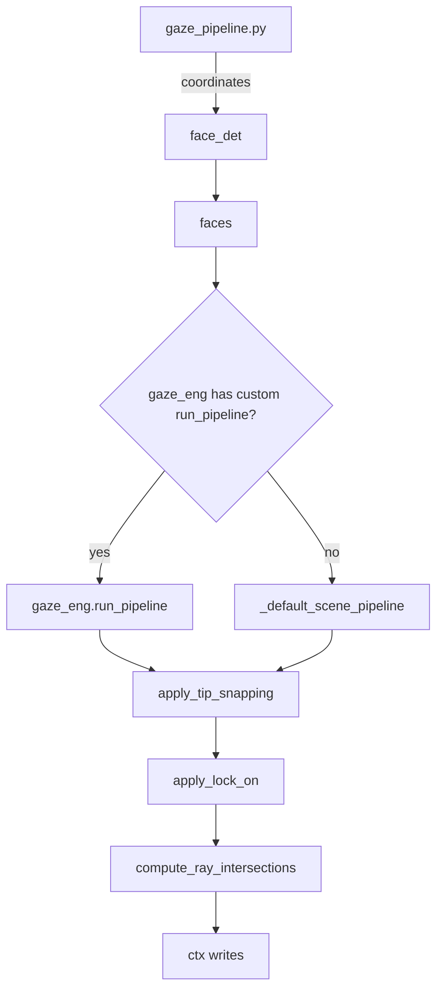

# Gaze Processing Module

Developer reference for the gaze estimation and processing pipeline in MindSight.

## 1. Overview

The gaze processing subsystem lives across five key locations:

| File / Directory | Purpose |
|---|---|
| `gaze_factory.py` | Selects and instantiates the active gaze backend |
| `gaze_processing.py` (~1 000 lines) | Core processing classes: smoothing, lock-on, snap hysteresis, ray geometry |
| `gaze_pipeline.py` | Per-frame coordinator that wires detection, estimation, and post-processing together |
| `pitchyaw_pipeline.py` | Pitch/yaw-specific pipeline utilities |
| `Backends/` | Plugin backends (MGaze, L2CS, UniGaze, Gazelle) |

## 2. Module Architecture



## 3. Gaze Factory

**File:** `gaze_factory.py`

```
create_gaze_engine(plugin_args) -> GazePlugin
```

Selects and instantiates the active gaze backend based on CLI flags:

1. Checks `gaze_registry` for installed plugins first.
2. Falls back to built-in backends if no plugin matches.

The returned engine conforms to the `GazePlugin` interface, which every backend must implement.

## 4. Gaze Pipeline Coordinator

**File:** `gaze_pipeline.py`

Entry point: `run_gaze_step(ctx, face_det, gaze_eng, gaze_cfg)`

### Execution order

1. **Face detection** -- Run RetinaFace on `detection_frame`, then rescale coordinates back to the original frame space using `inverse_scale`.
2. **Plugin delegation** -- If `gaze_eng` exposes a custom `run_pipeline()`, delegate to it; otherwise call `_default_scene_pipeline()`.
3. **Post-processing chain** -- `apply_tip_snapping` -> `apply_lock_on` -> `compute_ray_intersections`.

### FrameContext reads

`frame`, `detection_frame`, `inverse_scale`, `objects`, `cached_faces`, `smoother`, `locker`, `snap_hysteresis`

### FrameContext writes

`persons_gaze`, `face_confs`, `face_bboxes`, `face_track_ids`, `all_targets`, `hits`, `hit_events`, `lock_info`, `ray_snapped`, `ray_extended`

## 5. Core Processing Classes

**File:** `gaze_processing.py`

### GazeSmootherReID

Temporal EMA smoothing combined with re-identification across frames.

- Tracks faces using **position proximity** and **colour histogram matching**.
- Lost tracks remain in the buffer for `reid_grace_seconds` (grace period) before being discarded.

```
smooth_and_track(detections, gaze, face_crops, bboxes)
    -> (persons_gaze, track_ids)
```

### GazeLockTracker

Fixation lock-on mechanism.

- When a participant gazes near the same object for >= `dwell_frames` consecutive frames, their gaze is locked to that object.

```
update(persons_gaze, face_bboxes, objects, hit_events)
    -> (lock_info, updated_gaze)
```

### SnapHysteresisTracker

Adaptive snap with hysteresis to prevent rapid switching between snap targets.

- **Weighted scoring** combines three factors:
  - `snap_w_dist` -- distance from ray to target
  - `snap_w_size` -- angular size of target
  - `snap_w_intersect` -- ray-bbox intersection depth
- `switch_frames` sets the minimum number of frames before the tracker will change its snap target.

## 6. Ray Geometry

**Files:** `ms/GazeTracking/gaze_processing.py`, `ms/utils/geometry.py`

| Function | Signature | Description |
|---|---|---|
| `pitch_yaw_to_2d` | `(pitch, yaw) -> ndarray` | Converts pitch/yaw angles to a 2D direction vector |
| `ray_hits_box` | `(origin, endpoint, x1, y1, x2, y2) -> bool` | Liang-Barsky ray-box intersection test |
| `ray_hits_cone` | `(origin, direction, half_angle, x1, y1, x2, y2) -> bool` | Cone-box intersection test |
| `extend_ray` | `(origin, endpoint, length) -> ndarray` | Extends a ray to a new endpoint at the given length |
| `bbox_center` | `(x1, y1, x2, y2) -> ndarray` | Returns the center point of a bounding box |
| `bbox_diagonal` | `(x1, y1, x2, y2) -> float` | Returns the diagonal length of a bounding box |

## 7. Post-Processing Functions

### apply_tip_snapping

```
apply_tip_snapping(persons_gaze, ray_snapped, ray_extended, gaze_eng, gaze_cfg)
```

Operates in extend/snap mode. Extends gaze rays toward detected objects and snaps ray tips when within the configured threshold.

### apply_lock_on

```
apply_lock_on(persons_gaze, locker, objects)
```

Applies fixation lock using the `GazeLockTracker`. If a participant has been fixating on an object long enough, overrides the raw gaze with the locked target.

### compute_ray_intersections

```
compute_ray_intersections(persons_gaze, face_confs, track_ids, face_objs, objects, gaze_cfg)
```

Tests ray-bbox or ray-cone intersection for every (person, object) pair. Filters results through `hit_conf_gate` (minimum face-detection confidence) and `detect_extend` (whether to extend rays that miss all objects).

## 8. Global Motion Compensation

When the camera is handheld or mounted on a moving platform, global scene motion can cause false gaze shifts. The gaze pipeline includes an optional global motion compensation step that estimates inter-frame camera motion (via sparse optical flow) and subtracts it from gaze angle deltas before temporal smoothing. This prevents the smoother from integrating camera jitter into gaze tracks.

## 9. GazeToolkit

Extensible toolkit class designed for plugins to add custom processing steps. Plugin authors can subclass `GazeToolkit` and override or add methods to inject behaviour at any stage of the pipeline.

## 10. Backends

| Backend | Model type | Granularity | Notes |
|---|---|---|---|
| **MGaze** | ONNX or PyTorch (auto-detected) | Per-face | Default gaze estimation backend |
| **L2CS** | PyTorch | Per-face | L2CS-Net architecture |
| **UniGaze** | ViT | Per-face | Vision Transformer backbone |
| **Gazelle** | DINOv2 | Scene-level | Processes the full scene rather than individual faces |

All backends implement the `GazePlugin` interface, which requires at minimum an `estimate()` method and optionally a `run_pipeline()` override for scene-level models.
