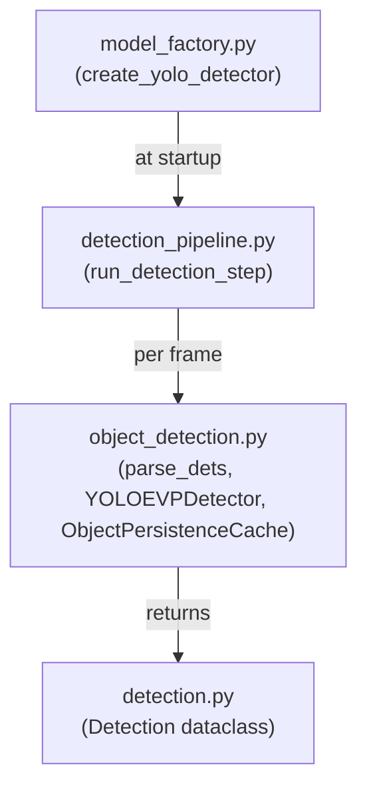

# Object Detection Module

## Overview

The `ms/ObjectDetection/` module handles all YOLO-based object detection in MindSight. It consists of four files:

| File | Purpose |
|------|---------|
| `detection.py` | `Detection` dataclass — the canonical data type for a single detection |
| `model_factory.py` | Factory functions for YOLO and RetinaFace model creation |
| `object_detection.py` | `YOLOEVPDetector`, `ObjectPersistenceCache`, and `parse_dets` |
| `detection_pipeline.py` | Per-frame pipeline step that orchestrates detection |

## Module Architecture



Data flows top-down at runtime:

1. **Startup** — `model_factory.py` builds the YOLO (or YOLOE VP) detector and returns it along with resolved class IDs and a blacklist set.
2. **Per frame** — `detection_pipeline.py` calls the detector, passes raw results through `parse_dets`, applies plugin hooks, splits persons from objects, and writes everything into the frame context.
3. **Data type** — Every detection throughout the system is a `Detection` instance defined in `detection.py`.

## Detection Dataclass

**File:** `ms/ObjectDetection/detection.py`

`Detection` is a slotted dataclass that replaces the implicit dict schema used in earlier versions.

### Fields

| Field | Type | Default | Description |
|-------|------|---------|-------------|
| `class_name` | `str` | required | YOLO class label (e.g. `"person"`, `"cup"`) |
| `cls_id` | `int` | required | Numeric YOLO class ID |
| `conf` | `float` | required | Detection confidence score |
| `x1, y1, x2, y2` | `int` | required | Bounding box coordinates (top-left, bottom-right) |
| `ghost` | `bool` | `False` | `True` when the detection is kept alive by `ObjectPersistenceCache` |
| `_face_idx` | `int \| None` | `None` | Index linking to a face detection (used when faces are treated as objects) |

### Dict-Compatible Access

For backward compatibility with code that treated detections as plain dicts, `Detection` supports bracket access and dict-like iteration:

- `det['x1']`, `det.get('conf', 0.0)`, `'ghost' in det`
- `det['x1'] = 100`, `det.update(x1=100, y1=200)`
- `det.keys()`, `det.values()`, `det.items()`

A `_KEY_MAP` class variable handles legacy key aliases. For example, `det['_ghost']` transparently reads the `ghost` attribute.

### Geometry Helpers

- **`center`** property — returns the bounding box center as a float numpy array `[cx, cy]`.

## Model Factory

**File:** `ms/ObjectDetection/model_factory.py`

### `create_yolo_detector`

```python
create_yolo_detector(
    model_path: str = "yolov8n.pt",
    classes: list | None = None,
    blacklist_names: list | None = None,
    vp_file: str | None = None,
    vp_model: str = "yoloe-26l-seg.pt",
    device: str = "auto",
) -> tuple[yolo, class_ids, blacklist_set]
```

- **Weight resolution:** bare filenames (no directory component) are resolved against `Weights/YOLO/`. The directory is created if it does not exist, so auto-downloaded models land there instead of the project root.
- **VP mode:** when `vp_file` is provided, the factory creates a `YOLOEVPDetector` instead of a standard YOLO model. In this mode `class_ids` is `None` and the blacklist is empty because classes come from the VP file.
- **Device resolution:** delegates to `ms/utils/device.py` which follows the priority order CUDA > MPS > CPU when device is `"auto"`.
- **Blacklist:** merges the built-in `BLACKLISTED_CLASSES` with any user-supplied `blacklist_names`, always excluding `"person"` from the blacklist.

### `create_face_detector`

```python
create_face_detector() -> RetinaFace
```

Returns a `RetinaFace` instance used for face-level detection in the gaze tracking pipeline. Adds the `ms/GazeTracking/gaze-estimation` directory to `sys.path` if not already present.

## YOLOEVPDetector

**File:** `ms/ObjectDetection/object_detection.py`

`YOLOEVPDetector` wraps a YOLOE model together with a Visual Prompt file (`.vp.json`) to provide the same callable interface as a standard Ultralytics YOLO model.

### Initialization

```python
YOLOEVPDetector(model_path: str, vp_file: str, device: str | None = None)
```

The constructor:

1. Loads and parses the VP JSON file, extracting reference image path, bounding box annotations, and class ID mappings.
2. Creates a `YOLOE` model from `model_path`.
3. Moves the model to the specified device if not CPU.

### Calling Convention

```python
detector(frame, conf=0.35, classes=None, verbose=False)
```

- **First call:** uses the reference image and visual prompts via `YOLOEVPSegPredictor` to initialize the model's visual prompt embeddings.
- **Subsequent calls:** runs standard `predict()` without visual prompt arguments (the embeddings persist).

### Properties

- **`names`** — dict mapping class ID to class name, populated from the VP file's `"classes"` array.

## ObjectPersistenceCache

**File:** `ms/ObjectDetection/object_detection.py`

Keeps detected objects alive for a configurable number of frames after they disappear from the detector output. This handles momentary occlusion and YOLO misses.

### Constructor

```python
ObjectPersistenceCache(max_age: int = 15, iou_threshold: float = 0.30)
```

- `max_age` — number of frames a detection survives without a match before removal.
- `iou_threshold` — minimum IoU required to consider an incoming detection as matching an existing slot.

### `update(current_dets) -> list[Detection]`

Each call:

1. **Matches** incoming detections to existing slots by `class_name` equality and IoU score.
2. **Ages** unmatched slots by one frame; removes any that exceed `max_age`.
3. **Returns** the combined list of fresh detections and ghost detections.

Ghost detections have `ghost=True` and are typically rendered with reduced opacity in the overlay.

### Matching Strategy

Matching is greedy: for each existing slot, the incoming detection with the highest IoU (above threshold and same class) is selected. New detections that do not match any slot create new slots.

## parse_dets

**File:** `ms/ObjectDetection/object_detection.py`

```python
parse_dets(results, names, conf_thr, blacklist) -> list[Detection]
```

Converts raw YOLO result boxes into a list of `Detection` objects. Each box is checked against:

- `conf_thr` — detections below this confidence are dropped.
- `blacklist` — detections whose lowercased class name appears in this set are dropped.

Returns an empty list if `results` is empty or the first result has no boxes.

## Pipeline Step

**File:** `ms/ObjectDetection/detection_pipeline.py`

```python
run_detection_step(ctx, *, yolo, det_cfg: DetectionConfig,
                   obj_cache=None, detection_plugins=None)
```

This is the per-frame entry point called from the main processing loop.

### FrameContext Reads

| Key | Description |
|-----|-------------|
| `frame` | BGR numpy array at full display resolution |
| `cached_all_dets` | Pre-computed detection list for skip-frame reuse (optional) |

### FrameContext Writes

| Key | Type | Description |
|-----|------|-------------|
| `all_dets` | `list[Detection]` | All detections in full-resolution coordinates |
| `persons` | `list[Detection]` | Subset where `class_name == 'person'` |
| `objects` | `list[Detection]` | Non-person detections, after persistence cache |
| `detection_frame` | `np.ndarray` | Frame fed to the detector (possibly downscaled) |
| `inverse_scale` | `float` | `1.0 / detect_scale`, used for coordinate mapping downstream |

### Processing Steps

1. **Scale** — if `det_cfg.detect_scale != 1.0`, the frame is resized before detection.
2. **Detect** — YOLO runs on the (possibly downscaled) frame via `parse_dets`.
3. **Rescale** — if downscaled, bounding box coordinates are multiplied by `inverse_scale` to map back to full resolution.
4. **Plugin hook** — each detection plugin's `detect()` method is called with `(frame, detection_frame, all_dets, det_cfg)` and may return a modified detection list.
5. **Split** — detections are partitioned into `persons` (class is `"person"`) and `objects` (everything else).
6. **Persistence cache** — `ObjectPersistenceCache.update()` is applied to `objects` only, adding ghost detections for recently-disappeared items.

### Skip-Frame Reuse

When `skip_frames > 1` is configured, the caller sets `ctx['cached_all_dets']` on non-detection frames. The pipeline step reuses that list directly, skipping YOLO inference and plugin hooks entirely.

## Extending Detection

To add custom post-processing to the detection pipeline, create an **ObjectDetectionPlugin** subclass:

```python
class MyDetectionPlugin:
    def detect(self, frame, detection_frame, all_dets, det_cfg):
        """
        Called after YOLO detection on each detection frame.

        Parameters
        ----------
        frame : np.ndarray
            Full-resolution BGR frame.
        detection_frame : np.ndarray
            Possibly downscaled frame that was fed to YOLO.
        all_dets : list[Detection]
            Current detection list (already rescaled to full resolution).
        det_cfg : DetectionConfig
            Detection configuration (conf threshold, scale, etc.).

        Returns
        -------
        list[Detection] or None
            Modified detection list. Return None to keep all_dets unchanged.
        """
        # Example: filter out low-confidence chairs
        return [d for d in all_dets
                if not (d.class_name == 'chair' and d.conf < 0.6)]
```

Plugins are passed to `run_detection_step` via the `detection_plugins` list. For details on how plugins are discovered, loaded, and configured, see [Plugin System](plugin-system.md).
