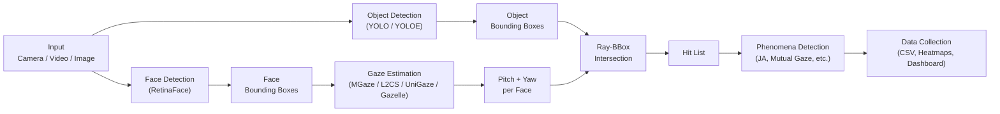

# MindSight

**Unified eye-gaze intersection tracking for behavioral neuroscience research.**

MindSight is an open-source toolkit that detects where people look in video, images, and live camera feeds, then maps those gaze vectors onto detected objects to identify social-cognitive phenomena such as joint attention, mutual gaze, and gaze following -- all from a single configurable pipeline.

!!! warning "Beta Notice"

    MindSight v0.3.0-beta is currently in **beta**. APIs, configuration formats, and output schemas may change between releases. Please pin your version and check the [Changelog](changelog.md) before upgrading.

---

## How It Works

MindSight processes each frame through a four-stage pipeline:

1. **Object & Face Detection** -- locates people, faces, and objects of interest in every frame.
2. **Gaze Estimation** -- predicts a 3-D gaze direction (pitch and yaw) for each detected face.
3. **Ray-BBox Intersection** -- casts each gaze ray and determines which bounding boxes it hits.
4. **Phenomena & Data Collection** -- classifies social-gaze events and writes structured output.

---

## Feature Highlights

### Core Functionality

- Frame-by-frame gaze-to-object intersection via ray casting
- Swappable object-detection backends (YOLO, YOLOE with visual prompts)
- Four swappable gaze-estimation backends (MGaze, L2CS-Net, UniGaze, Gazelle)
- Face anonymization for privacy-sensitive recordings
- Auxiliary video stream support for multi-camera setups
- CLI and GUI interfaces for flexible workflows
- YAML-driven pipeline configuration

### Phenomena Tracking

- **Joint Attention** -- two or more people attending to the same object
- **Mutual Gaze** -- two people looking at each other
- **Social Referencing** -- gaze shifts toward a reference person after an event
- **Gaze Following** -- one person's gaze directing another's
- **Gaze Aversion** -- active avoidance of eye contact
- **Scanpath Analysis** -- sequential fixation patterns over time
- **Gaze Leadership** -- identifying who initiates gaze shifts in a group
- **Attention Span** -- sustained fixation duration on targets

### Extensibility

- Plugin architecture for custom gaze backends, detectors, and phenomena
- Drop-in plugin discovery -- add a folder, register in YAML, run
- Base classes and hooks for every pipeline stage

### Research Tools

- Per-frame CSV export with full gaze and detection metadata
- Aggregated heatmap generation over configurable time windows
- Live dashboard with real-time gaze overlay
- Project mode for batch processing of multiple videos

---

## Where to Start

-   **I'm a researcher**

    ---

    Get MindSight running, process your first video, and explore the phenomena it can detect.

    - [Getting Started](getting-started/index.md) -- installation and first run
    - [User Guide](user-guide/index.md) -- pipeline configuration and workflows
    - [Phenomena](phenomena/index.md) -- detailed descriptions of each tracked phenomenon

-   **I'm a developer**

    ---

    Understand the internals, write plugins, and extend the pipeline.

    - [Architecture Deep Dive](developer/architecture.md) -- how the pipeline fits together
    - [Plugin System](developer/plugin-system.md) -- extension points and base classes
    - [Developer Guide](developer/index.md) -- module references and contribution guidelines

<!-- screenshot: MindSight GUI main window -->
