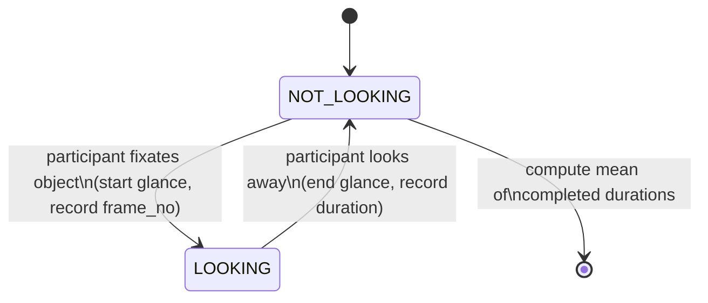

# Attention Span

## What It Is

Attention Span tracks per-participant per-object average attention span, measured as the mean duration of completed glances. A glance is a contiguous run of frames where a participant looks at a given object class. Only finished glances contribute to the average, ensuring the metric reflects complete, observable fixation episodes.

## Research Context

Average glance duration is a core measure in sustained attention research, ADHD screening, and engagement measurement. Comparing attention spans across participants, objects, or experimental conditions can reveal fatigue effects, stimulus salience differences, and individual differences in attentional control. It is also used in UX and advertising research to gauge how long viewers engage with specific elements.

## How MindSight Detects It

1. For each `(face_idx, class_name)` pair, track whether a glance is currently active.
2. If a participant IS looking at an object and no active glance exists, start a new glance by recording the current `frame_no`.
3. If a participant STOPS looking and has an active glance, end the glance. Compute its duration as `current_frame - start_frame` and append it to the completed durations list.
4. Only completed (ended) glances contribute to the average.
5. `most_salient(face_idx)` returns the object class with the highest mean completed-glance duration for that participant.
6. `all_averages(face_idx)` returns all per-object averages for a participant.



## Parameters

| Flag | Type | Default | Description |
|------|------|---------|-------------|
| `--attn-span` | bool | `False` | Enable per-participant per-object attention span tracking. |

## Output

**Dashboard** -- Panel titled "ATTN SPAN (salient)" showing the most salient object per participant with average glance duration in frames, e.g., `P0: knife  23.5f`.

**Console** -- Full breakdown per participant: most salient object highlighted, plus all per-object averages listed underneath.

**Time-series** -- `attn_span_max_avg`: line chart of the maximum average glance duration across all participants over time.

**CSV** -- No dedicated CSV section. Data is available programmatically via `dashboard_data()`.

## Example

```bash
python MindSight.py --source video.mp4 --attn-span
```

## Related Phenomena

- [Scanpath](scanpath.md) -- Captures the full fixation sequence across objects, providing temporal ordering context for attention spans.
- [Gaze Aversion](gaze-aversion.md) -- Complementary measure: tracks what participants avoid looking at, while attention span tracks how long they sustain fixation.

---

Source: `ms/Phenomena/Default/attention_span.py`
