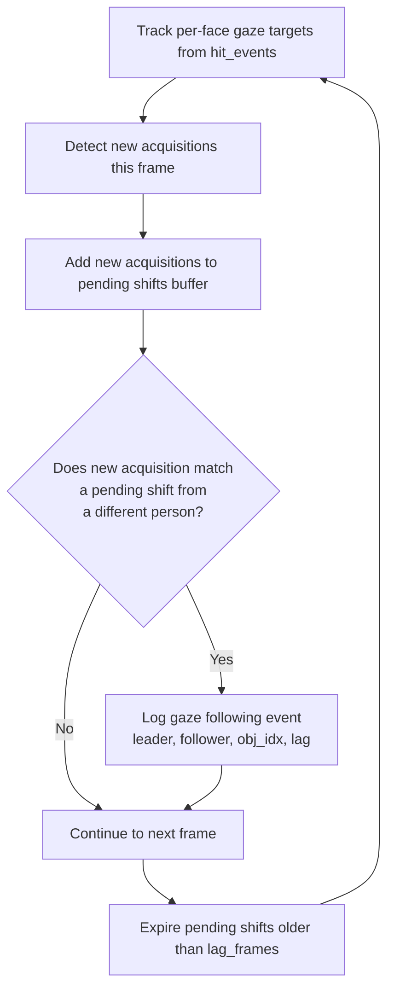

# Gaze Following

## What It Is

Gaze following occurs when one participant follows another's gaze to the same object target. Person A starts looking at an object, and within a configurable lag window, Person B also begins looking at that same object. This captures the natural human tendency to redirect attention based on where others are looking.

## Research Context

Gaze following is central to theory of mind, social learning, and attention cueing research. It is one of the earliest social-cognitive abilities to develop in infants and remains a fundamental mechanism through which humans coordinate attention throughout life. Studying gaze following helps researchers understand how individuals share awareness of their environment.

## How MindSight Detects It

The detection algorithm operates on a frame-by-frame basis using gaze hit events:

1. **Track per-face current gaze targets** from `hit_events`, building a mapping of which objects each face is currently looking at.
2. **Detect new acquisitions**: identify objects a face is looking at this frame but was not looking at in the previous frame.
3. **Maintain a pending shifts buffer** storing `(leader_face_idx, object_idx, frame_no)` entries. Entries expire after `lag_frames` have elapsed.
4. **Match against pending shifts**: when a new acquisition from one participant matches a pending shift from a different participant, a gaze following event is detected.
5. **Record the event**: leader, follower, object index, and the lag in frames between the two acquisitions.



## Parameters

| Parameter | Type | Default | Description |
|---|---|---|---|
| `--gaze-follow` | flag | disabled | Enable gaze following detection |
| `--gaze-follow-lag` | int | 30 | Maximum number of frames between leader and follower acquisitions for a match |

## Output

**CSV** (`gaze_following`): Each row contains `leader`, `follower`, `event_count`, and `avg_lag_frames`.

**Dashboard**: A "GAZE FOLLOWING" panel displays the last 3 detected events in the format `P1<-P0 lag=12f`.

**Console**: Reports the total gaze following event count.

**Time-series**: Plots cumulative follow events over time.

## Example

```bash
python MindSight.py --source video.mp4 --gaze-follow --gaze-follow-lag 45
```

## Related Phenomena

- [Gaze Leadership](gaze-leadership.md) -- identifies who consistently leads gaze shifts
- [Joint Attention](joint-attention.md) -- simultaneous shared attention on the same target
- [Social Referencing](social-referencing.md) -- gaze directed at others during uncertainty

## Source

`Phenomena/Default/gaze_following.py`
