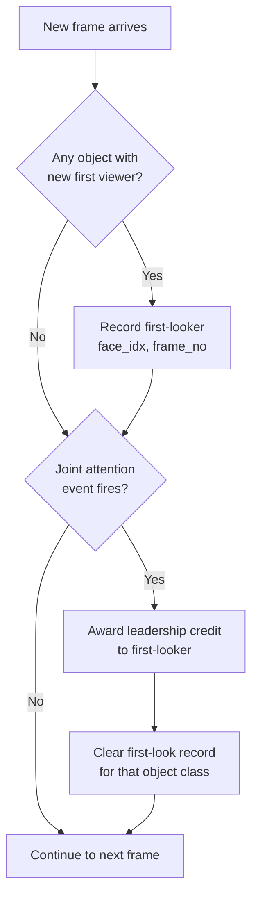

# Gaze Leadership

## What It Is

Gaze Leadership identifies which participant's gaze shifts are followed by others in a scene. When a participant is the first to look at an object that subsequently becomes a joint attention target, they receive a leadership credit. This metric quantifies initiative-taking in group visual attention.

## Research Context

Gaze leadership is relevant to studies of group dynamics, social hierarchy, and collaborative decision-making. In leadership research, the person who consistently directs others' attention is often the de facto leader, even in leaderless groups. Measuring who initiates shared gaze targets provides a behavioural proxy for influence and social dominance.

## How MindSight Detects It

MindSight supports two detection modes: object-based (default) and tip-convergence (optional).

### Object-Based Leadership (default)

1. **Track first-looker**: When an object class gains its first viewer (nobody was looking at it in the previous frame), record `(face_idx, frame_no)` as the first-look entry.
2. **Award on joint attention**: When a joint attention event fires on that object, award a leadership credit to the recorded first-looker.
3. **Clear record**: The first-look entry is removed after awarding to prevent credit accumulation on sustained joint attention.

### Tip-Convergence Leadership (optional)

1. Buffer each participant's gaze tip positions over the last `tip_lag` frames.
2. When a new convergence cluster appears (not sustained from the previous frame), find who arrived near the centroid earliest by scanning their tip buffer.
3. Award a leadership credit to the earliest arriver.



## Parameters

| Flag | Type | Default | Description |
|------|------|---------|-------------|
| `--gaze-leader` | bool | `False` | Enable gaze leadership tracking. |
| `--gaze-leader-tips` | bool | `False` | Also detect leadership via gaze-tip convergence (requires `--gaze-tips`). |
| `--gaze-leader-tip-lag` | int | `15` | Lookback frames for tip-arrival priority. |

## Output

**CSV** -- Section `gaze_leadership` with columns: `category`, `participant`, `object`, `frames_active` (credit count), `total_frames`, `value_pct`.

**Dashboard** -- Panel titled "GAZE LEADERSHIP" ranking participants by credit count (e.g., `P0: 5 events`).

**Console** -- Prints a dictionary of leadership counts per participant, e.g., `Gaze leadership counts: {'P0': 5, 'P1': 2}`.

**Time-series** -- `gaze_leadership_max`: step chart of the maximum leadership credit across all participants over time.

## Example

```bash
python MindSight.py --source video.mp4 --gaze-leader --joint-attention
```

## Related Phenomena

- [Joint Attention](joint-attention.md) -- Triggers leadership credits; gaze leadership has no effect without joint attention events.
- [Gaze Following](gaze-following.md) -- Provides a complementary leader-follower view: gaze following tracks who follows whom, while gaze leadership tracks who initiates shared targets.

---

Source: `Phenomena/Default/gaze_leadership.py`
