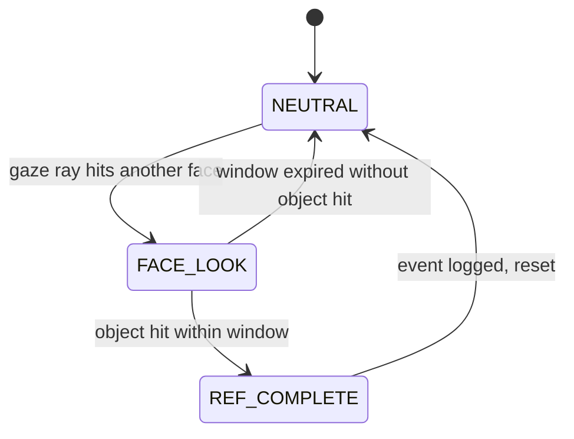

# Social Referencing

**Source:** `Phenomena/Default/social_referencing.py`

## What It Is

Social referencing occurs when a participant looks at another person's face and then redirects their gaze to an object within a defined time window. It captures the moment someone "checks" another person before turning attention to something in the environment. MindSight tracks these face-then-object sequences per participant using a frame-based state machine.

## Research Context

Social referencing is a key behavior in infant development research, where babies look to a caregiver's face for emotional cues before engaging with an unfamiliar object or situation. It is studied in the context of uncertainty resolution, social learning, and the development of emotional regulation. Beyond infancy, social referencing patterns appear in collaborative decision-making and group dynamics research.

## How MindSight Detects It

A per-face state machine runs each frame:

1. **NEUTRAL.** The participant is not currently looking at any other person's face. This is the resting state.

2. **FACE_LOOK.** The participant's gaze ray intersects another person's face bounding box. MindSight records the onset frame and which face(s) were targeted.

3. **Window check.** From the onset frame, MindSight watches for up to `social_ref_window` frames. If the participant's gaze shifts to hit a detected object (via the hit-events system) within that window, a social referencing event is logged.

4. **REF_COMPLETE.** The event is recorded with the participant's face index, the prior face target(s), the object name(s), and the frame number.

5. **Timeout.** If the window expires without an object look, the state resets to NEUTRAL.



## Parameters

| Flag | Type | Default | Description |
|---|---|---|---|
| `--social-ref` | bool | `False` | Enable social referencing tracking |
| `--social-ref-window` | int | `60` | Maximum number of frames after a face look in which an object look counts as a referencing event |
| `--all-phenomena` | bool | `False` | Enable all phenomena including social referencing |

## Output

**CSV** (`social_reference` section):
- Per-participant event counts and details of each referencing episode

**Dashboard:**
The last 3 social referencing events are displayed, formatted as "P0 [P1] -> knife" (participant 0 looked at participant 1, then at a knife).

**Console:**
Total event count per participant printed at the end of the session.

## Example

```bash
python MindSight.py --source video.mp4 --social-ref --social-ref-window 90
```

This enables social referencing detection with a 90-frame window (instead of the default 60). A participant has up to 90 frames after looking at someone's face to redirect gaze to an object for the event to count.

## Related Phenomena

- [Gaze Following](gaze-following.md) -- related sequential gaze behavior, but tracks direction-matching rather than face-then-object sequences
- [Mutual Gaze](mutual-gaze.md) -- the bidirectional counterpart to the face-looking component of social referencing
