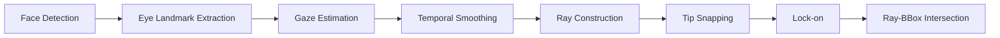

# Gaze Estimation & Intersection

## Overview

MindSight detects faces with RetinaFace, estimates a gaze direction for each face, constructs 2D rays, and intersects them with object bounding boxes to determine what each person is looking at.

The gaze sub-pipeline proceeds through the following stages:



Each stage is configurable through command-line flags described in the sections below.

---

## Gaze Backends

MindSight supports multiple gaze estimation backends. Select one by providing the appropriate model flag.

Backends are auto-discovered from `ms/GazeTracking/Backends/` via the backend registry. Any conforming backend placed in that directory is available automatically without code changes.

| Backend | Trigger | Mode | Notes |
|---------|---------|------|-------|
| MGaze (default) | `--mgaze-model <path>` | per-face | ONNX or PyTorch inference, auto-selected by file extension (`.onnx` or `.pt`). Fastest option for real-time use. |
| L2CS-Net | `--l2cs-model <weights>` | per-face | ~3x more accurate than MGaze on MPIIGaze (3.92 deg MAE) |
| UniGaze | `--unigaze-model <variant>` | per-face | Best cross-dataset accuracy (~9.4 deg on Gaze360). Non-commercial license |
| Gazelle | `--gazelle-model <ckpt>` | scene-level | DINOv2 backbone; processes all faces in one forward pass; outputs heatmap |

### MGaze

MGaze is the default gaze estimation backend. It supports two inference modes, auto-detected from the model file extension:

- **ONNX mode** (`.onnx`): Fastest. Hardware acceleration is auto-selected: CoreML on Apple Silicon Macs, CUDA on NVIDIA GPUs, CPU elsewhere.
- **PyTorch mode** (`.pt`): For custom-trained models. Requires `--mgaze-arch` to specify the architecture (e.g., `resnet18`, `resnet50`). Slightly slower than ONNX due to lack of graph optimisation.

The default shipped model is `mobileone_s0_gaze.onnx`. Pass any weights file to `--mgaze-model` and the correct inference mode is selected automatically.

### L2CS-Net

A higher-accuracy alternative that uses dual classification heads (one for pitch, one for yaw) to bin gaze angles into discrete classes, then refines with soft expectation. Approximately 3x more accurate than MGaze on the MPIIGaze benchmark (3.92 deg mean angular error). Heavier compute cost.

### UniGaze

A unified gaze estimation model built on a ViT backbone with MAE pre-training, trained across multiple datasets. Achieves the best cross-dataset generalisation (~9.4 deg on Gaze360). Released under a non-commercial license -- check the license before deploying in production.

### Gazelle

A scene-level model built on DINOv2. Instead of cropping individual faces, Gazelle processes the full frame and outputs a gaze heatmap for every detected face in a single forward pass. Best for multi-person scenes where per-face cropping is a bottleneck.

---

## Ray Parameters

These flags control the geometry of the gaze ray drawn from each face.

- **`--ray-length`** (float, default `1.0`): Multiplier on ray length, expressed as a multiple of the detected face width. A value of `2.0` draws a ray twice as long as the face is wide.
- **`--conf-ray`**: When enabled, scales the ray length by the gaze confidence score. High-confidence gazes produce longer rays; uncertain gazes produce shorter ones.
- **`--gaze-cone`** (float, default `0.0`): Replaces the single ray with a vision cone of the specified angle in degrees. A value of `0.0` disables the cone and uses a standard ray.

---

## Adaptive Ray (Snapping)

Adaptive ray mode adjusts the ray endpoint toward nearby objects, simulating the tendency of gaze to land on salient targets.

```
--adaptive-ray <mode>
```

### Modes

| Mode | Behaviour |
|------|-----------|
| `off` (default) | No snapping. Ray follows raw gaze direction. |
| `extend` | Freely extends the ray toward the nearest qualifying object. |
| `snap` | Locks the ray endpoint to the centre of the nearest qualifying object. |

### Snap Distance

```
--snap-dist 150.0
```

The snap radius in pixels. Objects beyond this distance from the ray tip are not considered for snapping.

```
--snap-bbox-scale <fraction>
```

Adds a fraction of the object's bounding box diagonal to the snap radius. Larger objects become easier to snap to.

### Weighted Scoring

When multiple objects fall within the snap radius, a weighted score determines the winner:

| Weight Flag | Default | Factor |
|-------------|---------|--------|
| `--snap-w-dist` | 1.0 | Inverse distance from ray tip to object centre |
| `--snap-w-size` | 0.0 | Object bounding box area |
| `--snap-w-intersect` | 0.0 | Whether the raw ray already intersects the object |

### Hysteresis

```
--snap-switch-frames 8
```

The number of consecutive frames a new target must win the scoring before the snap actually switches to it. Prevents rapid flickering between nearby objects.

---

## Gaze Lock-on

Lock-on detects sustained fixation on a single object and visually confirms it.

```
--gaze-lock
```

### Parameters

- **`--dwell-frames`** (int, default `15`): Number of consecutive frames a gaze must remain on the same target before lock-on activates.
- **`--lock-dist`** (int, default `100`): Pixel radius around the target centre. The gaze ray tip must stay within this radius for dwell counting to continue.

### Visual Feedback

- A **dwell arc** appears around the face dot, filling progressively as dwell frames accumulate.
- When lock-on activates, a **"LOCKED"** label is drawn on the target object.

---

## Smoothing & Re-ID

### Temporal Smoothing

Gaze direction is smoothed with an exponential moving average (EMA). The smoothing alpha is defined in `ms/constants.py`. Lower alpha values produce smoother but more sluggish tracking; higher values are more responsive but noisier.

### Face Re-ID

`GazeSmootherReID` tracks faces across frames using a combination of position proximity and colour histogram similarity. This allows the smoother to maintain per-identity state even when face detection IDs are not stable across frames.

- **`--reid-grace-seconds`** (float, default `1.0`): How long (in seconds) a lost face track remains in the re-ID buffer before being discarded.
- **`--reid-max-dist`** (int, default `200`): Maximum pixel distance between a new detection and a buffered track for re-ID matching to be considered.

---

## Intersection Detection

### Ray-BBox Intersection

MindSight uses the Liang-Barsky algorithm to test whether a gaze ray intersects an object's axis-aligned bounding box. When a hit is detected, the object is marked as a gaze target for that frame.

### Cone-AABB Intersection

When `--gaze-cone` is enabled (value > 0), intersection testing switches to cone-AABB. The vision cone is tested against each object's bounding box to determine overlap.

### Parameters

- **`--hit-conf-gate`** (float, default `0.0`): Minimum face detection confidence required for a gaze hit to be registered. Faces below this threshold are still drawn but their intersections are ignored.
- **`--detect-extend`** (float, default `0.0`): Extends detection by N pixels past the visual ray endpoint. Useful when the visual ray appears to just miss an object that the person is plausibly looking at.

---

## Forward Gaze

```
--forward-gaze-threshold 5.0
```

When both pitch and yaw angles are below this threshold (in degrees), the gaze is classified as "looking at the camera." This is used by downstream phenomena such as mutual gaze and gaze aversion. Default: `5.0`.

---

## Parameter Reference

| Flag | Type | Default | Description |
|------|------|---------|-------------|
| `--mgaze-model` | str | None | Path to MGaze model (`.onnx` or `.pt`). Inference mode auto-detected from extension. |
| `--mgaze-arch` | str | None | Architecture name (required for `.pt` models only) |
| `--l2cs-model` | str | None | Path to L2CS-Net weights |
| `--unigaze-model` | str | None | UniGaze model variant |
| `--gazelle-model` | str | None | Path to Gazelle checkpoint |
| `--ray-length` | float | `1.0` | Ray length multiplier (x face width) |
| `--conf-ray` | flag | off | Scale ray length by gaze confidence |
| `--gaze-cone` | float | `0.0` | Vision cone angle in degrees (0 = ray) |
| `--adaptive-ray` | str | `off` | Snap mode: `off`, `extend`, `snap` |
| `--snap-dist` | float | `150.0` | Snap radius in pixels |
| `--snap-bbox-scale` | float | `0.0` | Fraction of bbox diagonal added to snap radius |
| `--snap-w-dist` | float | `1.0` | Snap weight: inverse distance |
| `--snap-w-size` | float | `0.0` | Snap weight: object area |
| `--snap-w-intersect` | float | `0.0` | Snap weight: raw intersection |
| `--snap-switch-frames` | int | `8` | Hysteresis frames before switching snap target |
| `--gaze-lock` | flag | off | Enable fixation lock-on |
| `--dwell-frames` | int | `15` | Frames of sustained gaze before lock activates |
| `--lock-dist` | int | `100` | Lock detection radius in pixels |
| `--reid-grace-seconds` | float | `1.0` | Re-ID buffer retention time in seconds |
| `--reid-max-dist` | int | `200` | Max pixel distance for re-ID matching |
| `--hit-conf-gate` | float | `0.0` | Minimum face confidence for gaze hits |
| `--detect-extend` | float | `0.0` | Extend detection past visual ray (pixels) |
| `--forward-gaze-threshold` | float | `5.0` | Pitch/yaw threshold for forward gaze (degrees) |

!!! tip "Under the hood"
    For implementation details, see [developer/gaze-processing-module.md](../developer/gaze-processing-module.md).
