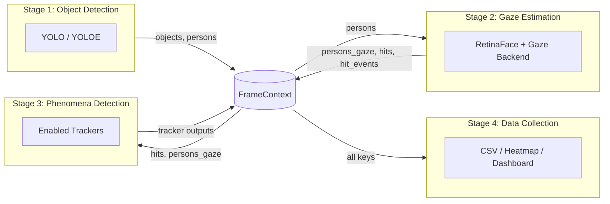

# The MindSight Pipeline

MindSight processes each video frame through four sequential stages, connected by a shared **FrameContext** that carries data between them. This page explains the architecture at a conceptual level and points you to deeper references.

---

## Overview

Every frame passes through the same four-stage pipeline:

1. **Object Detection** -- find objects and persons in the frame.
2. **Gaze Estimation** -- estimate where each person is looking and test for intersections.
3. **Phenomena Detection** -- identify higher-level social behaviors from gaze data.
4. **Data Collection** -- log results to CSV, accumulate heatmaps, and compose dashboards.

Each stage reads from and writes to the **FrameContext**, a per-frame data bus that keeps stages decoupled.

---

## Pipeline Architecture

---

## FrameContext: The Data Bus

A **FrameContext** is created for every frame. It behaves like a dictionary: each pipeline stage reads the keys it needs and writes its results back. This design means stages have no direct dependencies on each other -- they only depend on the data contract defined by FrameContext keys.

Key examples:

| Key | Written by | Consumed by |
|---|---|---|
| `objects` | Object Detection | Gaze Estimation, Data Collection |
| `persons` | Object Detection | Gaze Estimation |
| `persons_gaze` | Gaze Estimation | Phenomena Detection, Data Collection |
| `hits` | Gaze Estimation | Phenomena Detection, Data Collection |
| `hit_events` | Gaze Estimation | Phenomena Detection |

!!! tip "Under the hood"
    See [developer/frame-context.md](../developer/frame-context.md) for the full FrameContext key reference and typing information.

---

## Stage 1: Object Detection

YOLO (or YOLOE for open-vocabulary detection) runs on each frame to produce bounding boxes for objects and persons. Detections are written to the FrameContext as `objects` and `persons`.

An **ObjectPersistenceCache** handles short-term occlusions by retaining recently-seen objects for a configurable number of frames, preventing flickering when objects are momentarily hidden.

!!! info "More details"
    See [user-guide/object-detection.md](object-detection.md) for configuration options, model selection, and persistence tuning.

---

## Stage 2: Gaze Estimation

This stage has three sub-steps:

1. **Face detection** -- RetinaFace (via `uniface`) locates faces within person bounding boxes.
2. **Gaze inference** -- The selected backend (MobileOne, Gazelle, L2CS, or UniGaze) estimates pitch and yaw angles for each face.
3. **Ray-object intersection** -- A gaze ray is constructed from the face center using the estimated angles and tested against all object bounding boxes. Intersections are recorded as `hits`.

Additional features applied at this stage:

- **Smoothing** -- Exponential moving average reduces jitter in gaze angles.
- **Lock-on** -- Once a gaze ray hits an object, the hit is sustained for a configurable grace period to handle brief look-aways.
- **Snap** -- Gaze rays within a threshold of an object edge are snapped to the object center.

!!! info "More details"
    See [user-guide/gaze-estimation.md](gaze-estimation.md) for backend selection, smoothing parameters, and intersection logic.

---

## Stage 3: Phenomena Detection

Enabled phenomenon trackers receive per-frame data and detect social gaze behaviors. Each tracker is an independent module that reads from the FrameContext and writes its own output keys.

Built-in phenomena include:

- **Joint Attention** -- Two or more people looking at the same object.
- **Mutual Gaze** -- Two people looking at each other.
- **Gaze Following** -- One person shifts gaze to match another's target.
- **Gaze Leadership** -- One person consistently leads gaze shifts.
- **Gaze Aversion** -- A person breaks eye contact.
- **Social Referencing** -- A person looks at another after encountering a stimulus.
- **Attention Span** -- Duration a person fixates on a single target.
- **Scanpath** -- Sequence of gaze targets over time.

!!! info "More details"
    See [user-guide/phenomena-overview.md](phenomena-overview.md) for enabling/disabling trackers and configuring their parameters.

---

## Stage 4: Data Collection

The final stage reads from the FrameContext and produces output:

- **CSV logging** -- Per-frame rows with gaze angles, hit objects, and active phenomena.
- **Heatmap accumulation** -- Spatial attention maps accumulated across frames.
- **Dashboard composition** -- An overlay combining the annotated frame, heatmap, and statistics panels.

!!! info "More details"
    See [user-guide/data-output.md](data-output.md) for output file formats, heatmap configuration, and dashboard layout options.

---

## Frame Skipping

MindSight provides two frame-skipping options to improve throughput on long videos:

### `--skip-frames N`

Runs the full pipeline only every N-th frame. On intermediate frames, the most recent FrameContext is reused so that overlays and data output remain continuous without re-running detection and gaze inference.

### `--skip-phenomena N`

Runs phenomena trackers only every N-th frame, while object detection and gaze estimation still execute every frame. Useful when phenomena detection is expensive but you need full-resolution gaze data.

!!! warning
    High skip values reduce temporal resolution for phenomena that depend on frame-to-frame transitions (e.g., Gaze Following, Gaze Leadership). Start with small values and verify output quality.

---

## Performance Modes

MindSight includes several flags to trade output richness for speed:

| Flag | Effect |
|---|---|
| `--fast` | Enables all speed optimizations (combines the flags below). |
| `--lite-overlay` | Draws only bounding boxes and gaze rays; skips text labels and statistics. |
| `--no-dashboard` | Disables the dashboard composition step entirely. |
| `--profile` | Prints per-stage timing after each frame for performance diagnosis. |

!!! tip "Under the hood"
    `--profile` writes a `profile.csv` alongside the output video, which you can load in a spreadsheet to identify bottlenecks. See [developer/profiling.md](../developer/profiling.md) for analysis tips.
